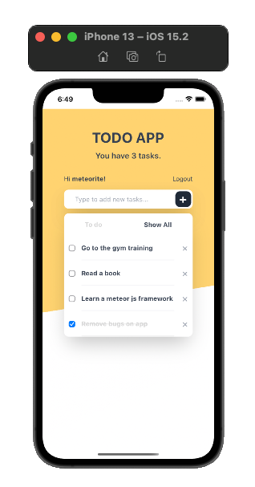

## Simple Todo List

The goal of this project is to use Meteor.js, Vue.js to create a cross-platform to-do list application based on [tutorial](https://vue-tutorial.meteor.com/simple-todos/).

### Demo

[demo]

### Screenshots



### Installation

- Clone the repo.

  ```bash
  git clone https://github.com/lokyiec/simple-todos-vue && cd simple-todos-vue
  ```

- Install dependencies.
    ```bash
  meteor npm install
  ```
- Start project.
    ```bash
  meteor run
  ```
